# Dimmer-MAUI
Time Spent So Far... 

# Dimmer A Cross Platform Music Player App built in .NET MAUI.

Building this as a hobby and also because the music app I use on Windows (Dopamine) and on Android (Retro Music Player) are discontinued.

## Screenshots at bottom of the page

# Features so far;
- Play/Pause Songs (I knooow..)
- Show Sync lyrics from either .lrc file or from song's metadata.
- Lyrics download.
- Discord Rich Presence For PC
- More to come such as playlist management, song's editing, statistics etc..

# Requirements
- A PC running Windows 10 at least.
- An Android Device running Android 13 at least (API 33).
- Visual Studio 2019, 2022 or latest (It was built on VS 2022) with MAUI support.

# How To Install on Windows
- Download the release and extract package [Here](https://github.com/YBTopaz8/Dimmer-MAUI/releases)
- Right Click on "install.ps1" and click "Run with PowerShell"
- Review all on screen instructions and agreed to install certificates and the app.
- Open the App from Start Menu.
- Enjoy
  
# How to install on Android
- Download the release.apk package [Here](https://github.com/YBTopaz8/Dimmer-MAUI/releases)
- Install the app
- Run.

# ScreenShots (Work in Progress...)
| Windows | Android| 
| ------------- |:-------------:|
| 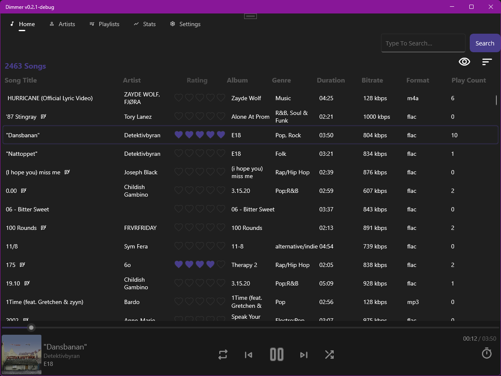| 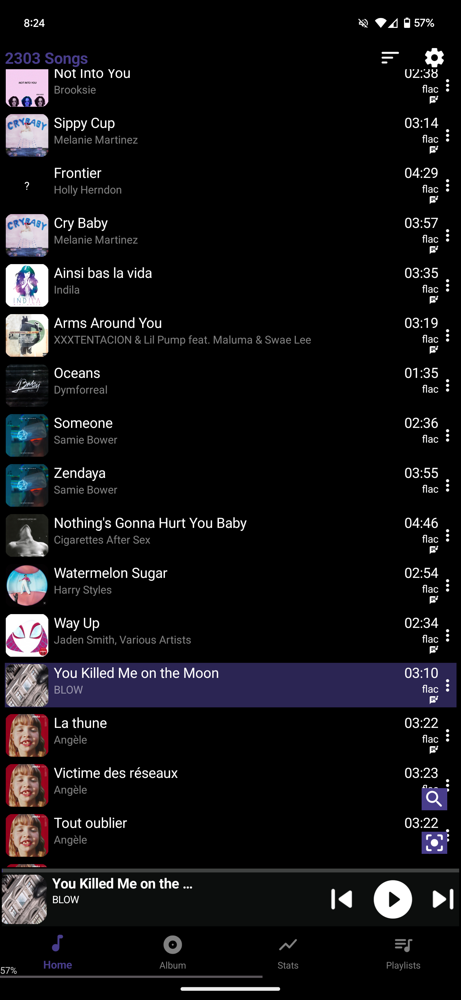 |
| 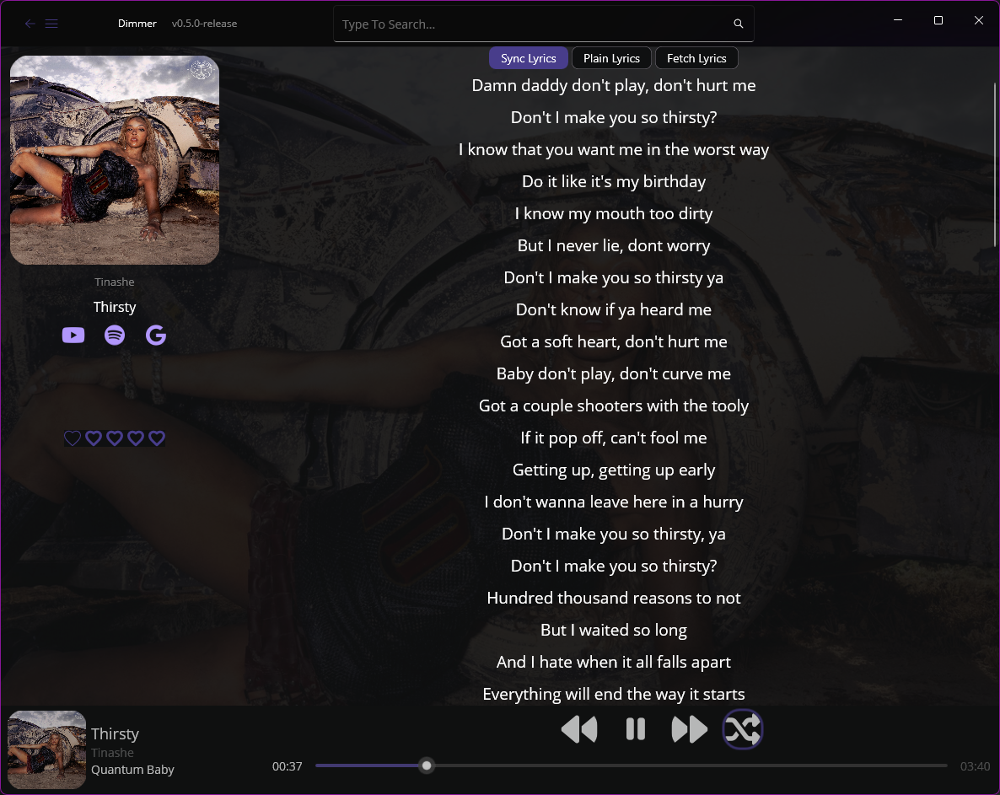| 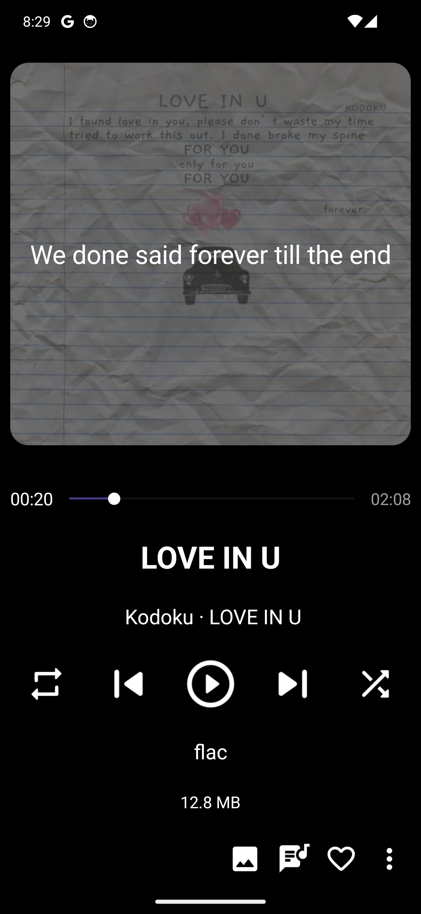 |
| 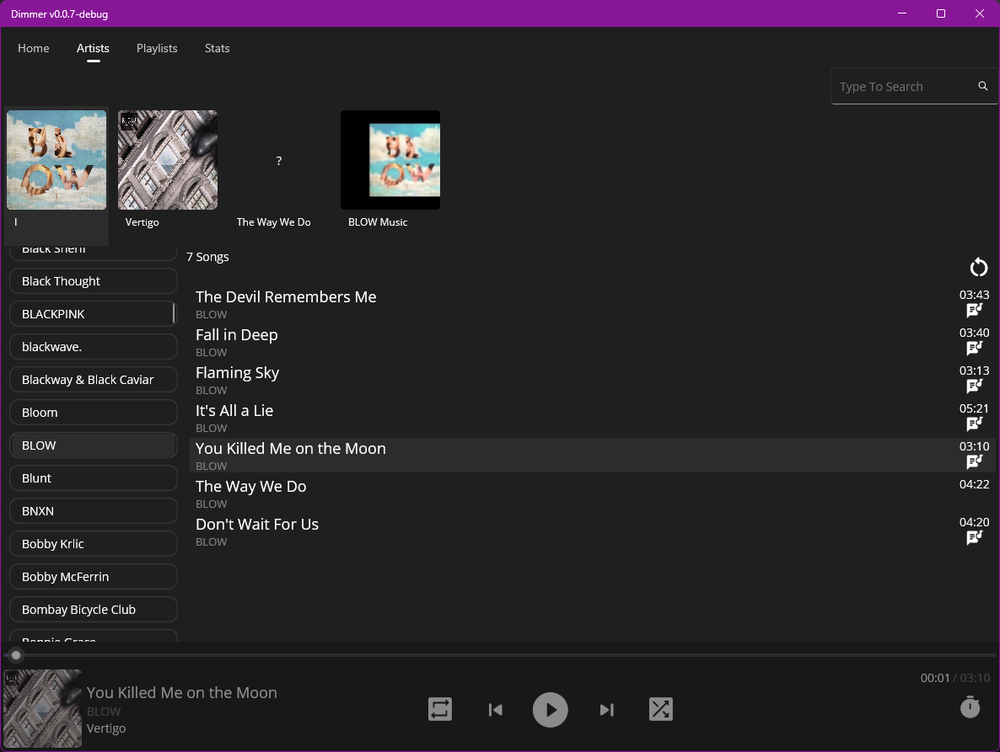| 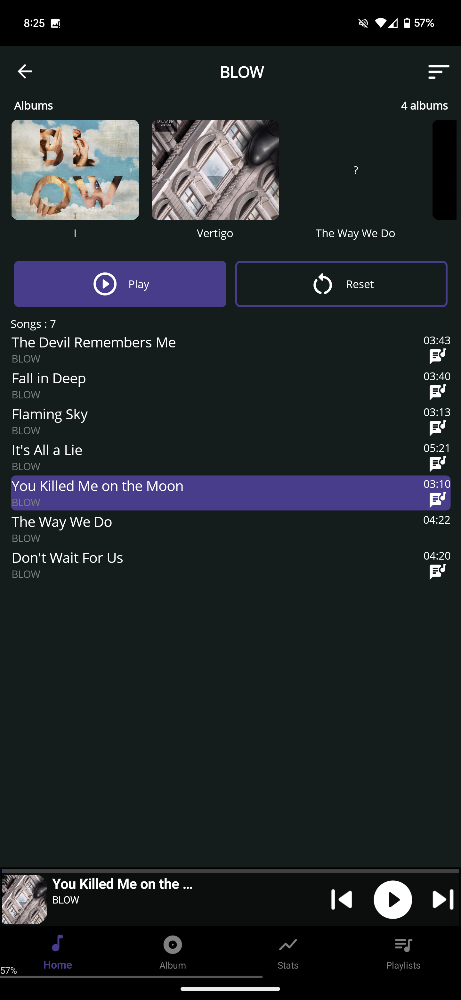 |
| 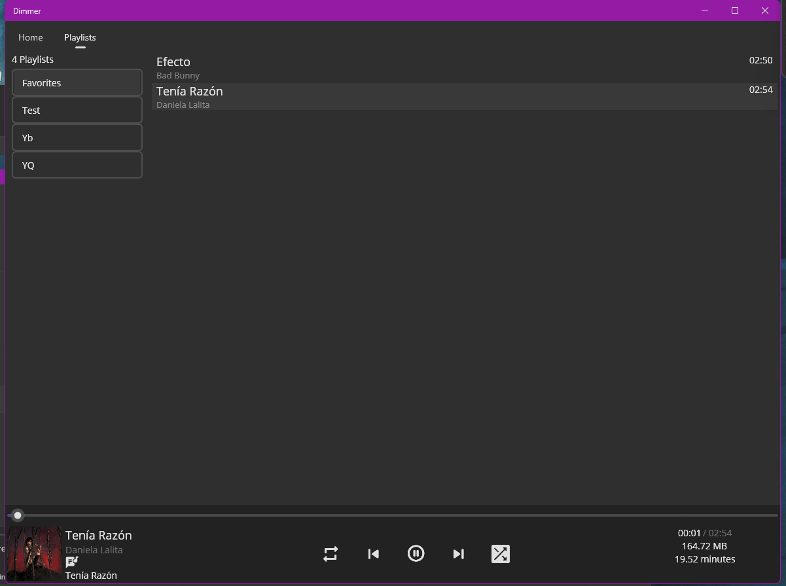| 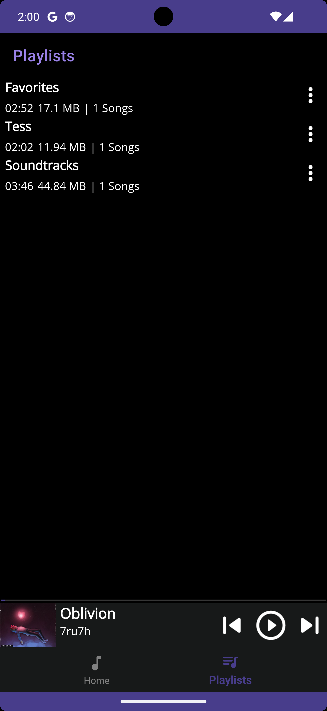 |
| 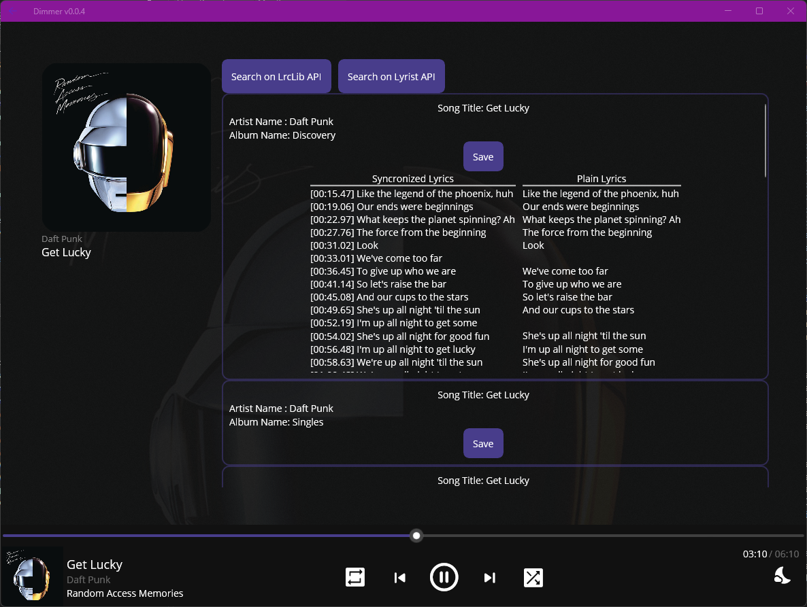| |
| 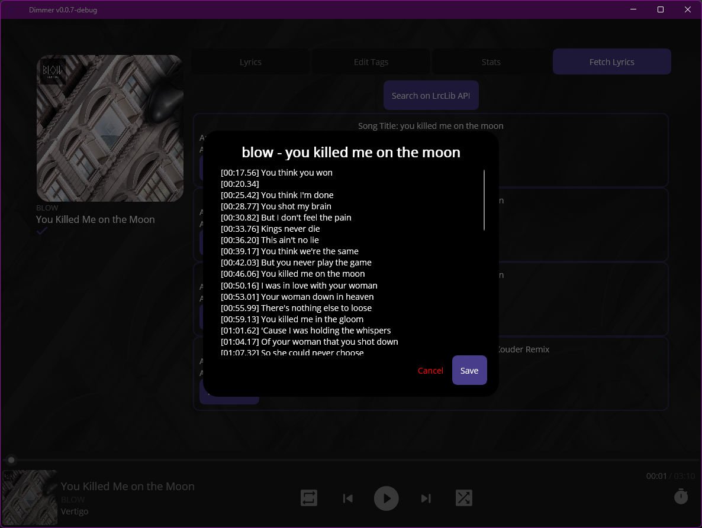| 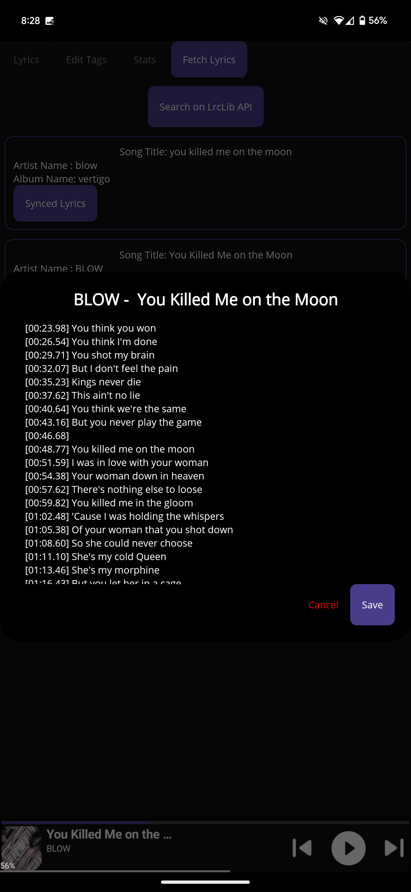|
| 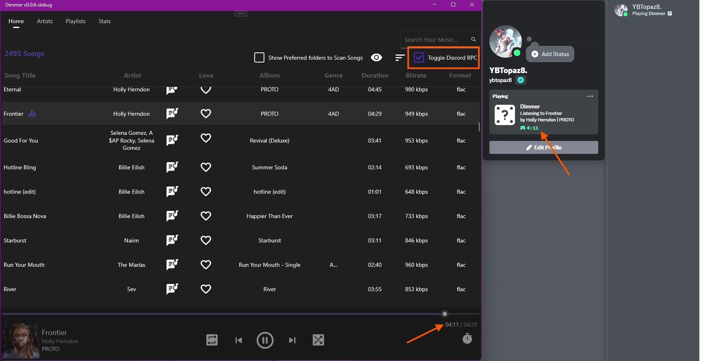| 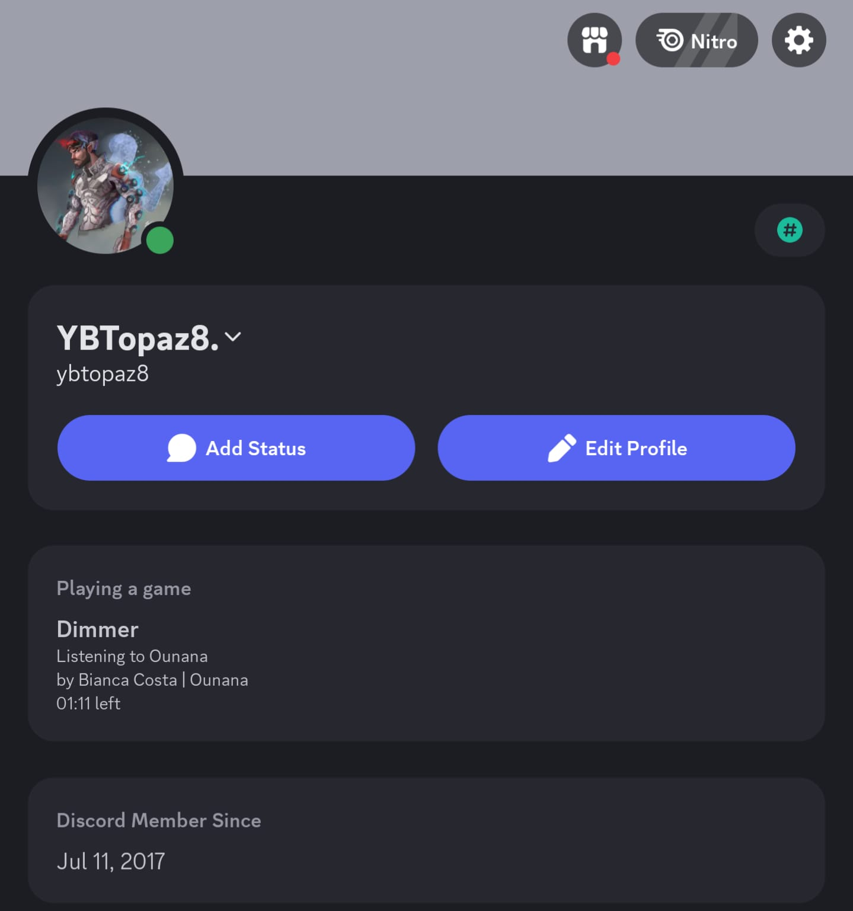|

|Windows Only|
|:-------------:|
| 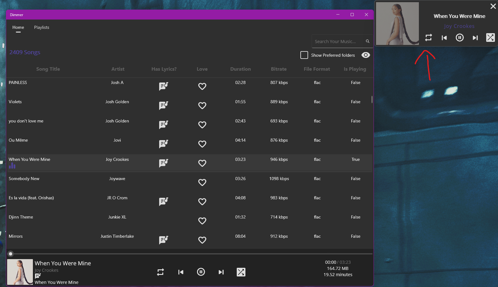|

|Android Only|
|:-------------:|
| 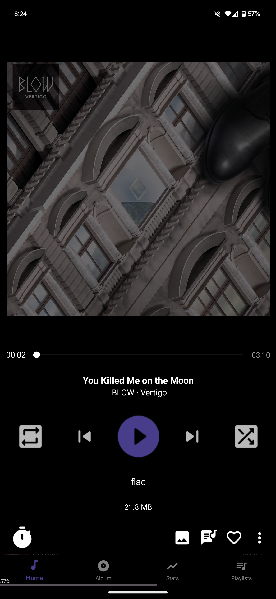 | 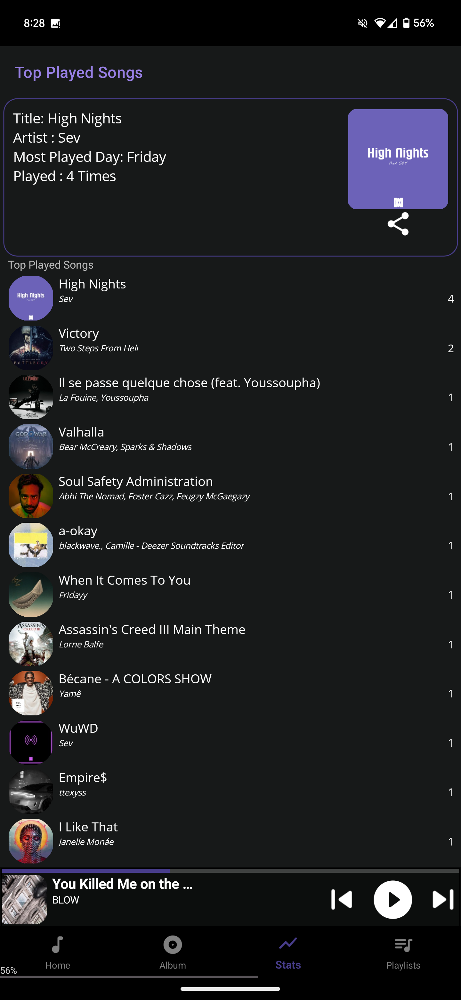 |
| 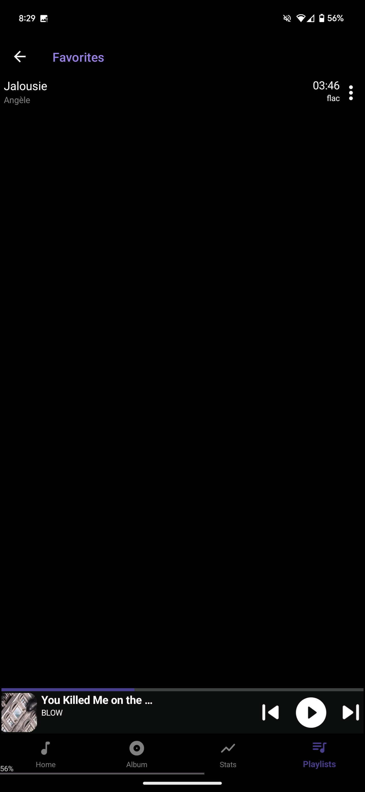  |
## Authors
- [Yvan Brunel](https://github.com/YBTopaz8) (Author)

 [My Simple Portfolio](https://flowcv.me/ybtopaz)

# Disclaimer:
Running the included sideloading PowerShell script to install will collect usage data on the device where it's run. This is by default set by MS, I'll find a way to remove it.
I don't need anyone's info 🙂
